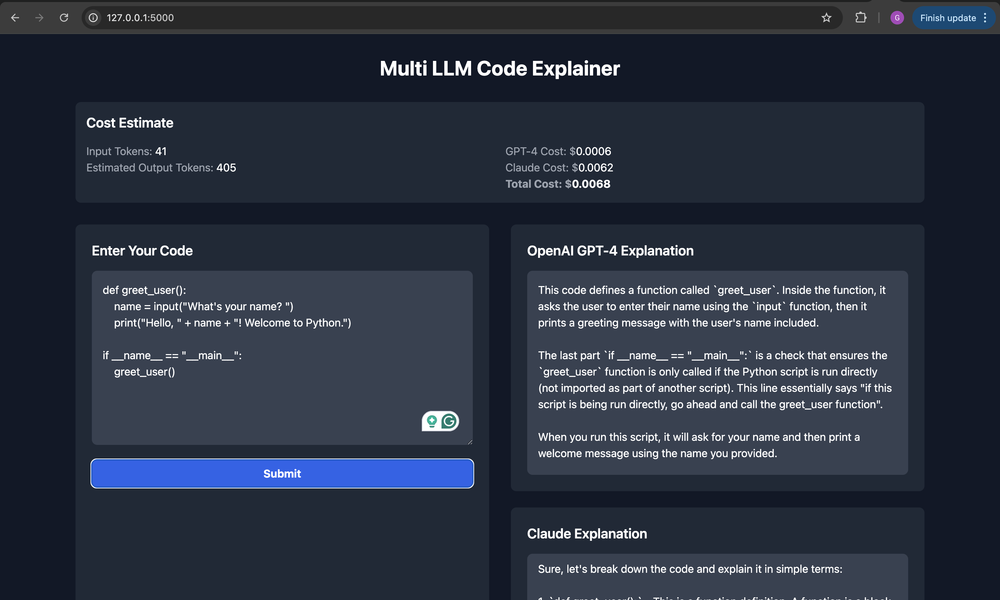
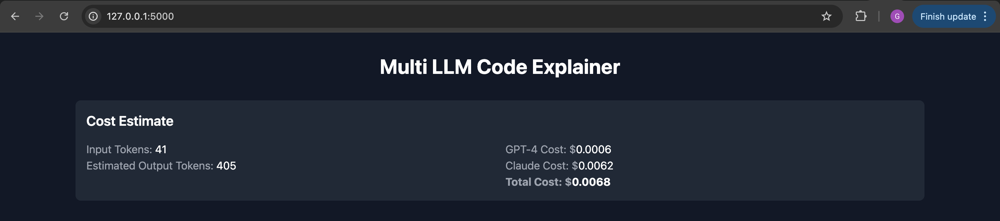
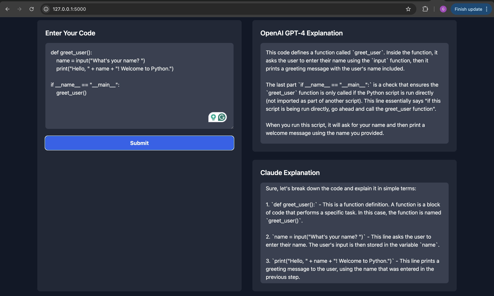

# Multi LLM Code Explainer

A powerful web application that explains code using multiple Large Language Models (LLMs) - OpenAI's GPT-3.5 and Anthropic's Claude-3. The application provides parallel explanations from both models, allowing users to compare different interpretations of their code. (MAIN AI CODE EXPLAINING MODEL PULLED FROM HUGGING FACE)



## Features

- 🚀 Dual AI Code Explanation: Get explanations from both GPT-3.5 and Claude-3
- 💰 Real-time Cost Estimation: See estimated costs before processing
- 🔒 Token Limit Management: Automatic handling of token limits
- 💼 Budget Control: Set maximum cost per request and monthly budgets
- 🎨 Clean, Modern UI: User-friendly interface for code input and explanations
- 📊 Usage Statistics: Track token usage and costs

## How It Works

The application uses a Flask backend to:
1. Accept code input from users
2. Estimate token usage and costs
3. Send the code to both OpenAI and Anthropic APIs
4. Return parallel explanations from both models

### Technical Architecture

- **Frontend**: HTML/CSS/JavaScript
- **Backend**: Python Flask
- **APIs**: 
  - OpenAI GPT-3.5
  - Anthropic Claude-3
- **Token Management**: tiktoken for accurate token counting
- **Environment Management**: python-dotenv for secure configuration

## Setup and Installation

1. Clone the repository:
```bash
git clone https://github.com/yourusername/multi-llm-code-explainer.git
cd multi-llm-code-explainer
```

2. Create a virtual environment:
```bash
python -m venv venv
source venv/bin/activate  # On Windows: venv\Scripts\activate
```

3. Install dependencies:
```bash
pip install -r requirements.txt
```

4. Set up environment variables:
- Copy `.env.example` to `.env`
- Add your API keys:
  - Get OpenAI API key from: https://platform.openai.com/
  - Get Anthropic API key from: https://console.anthropic.com/

5. Run the application:
```bash
cd app
python app.py
```

6. Visit `http://127.0.0.1:5000` in your browser

## Security Considerations

- API keys are stored in `.env` file (not committed to Git)
- Token and cost limits prevent excessive API usage
- Input validation and sanitization implemented
- Rate limiting on API requests

## Cost Management

The application estimates costs based on:
- Input tokens (code length)
- Estimated output tokens
- Current API pricing for both models

Default limits:
- Max cost per request: $0.50
- Monthly budget: $10.00

## Screenshots

### Cost Estimation


### Code Explanation


## Adding Screenshots to Your Repository

1. Create a `docs/images` directory in your repository
2. Save the screenshots you shared with me as:
   - `app-screenshot.png`
   - `cost-estimate.png`
   - `code-explanation.png`
3. Add them to the `docs/images` directory
4. They will be displayed in the README as shown above

## Contributing

1. Fork the repository
2. Create a feature branch
3. Commit your changes
4. Push to the branch
5. Create a Pull Request

## License

MIT License - See LICENSE file for details 
